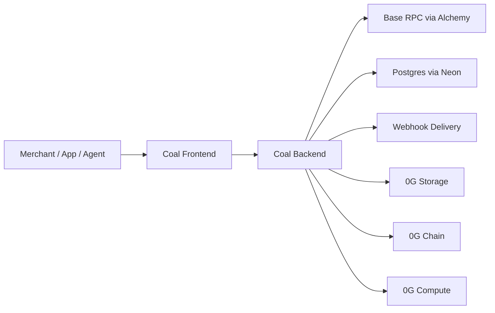

# Coal

**Coal by Schema Labs is a programmable commerce platform for hosted checkout, merchant APIs, payment links, paywalls, recurring billing, and agentic commerce flows.**

Coal is built around a simple split:

- `Coal` handles checkout orchestration, merchant operations, payer-info capture, recurring billing, and settlement flows on Base.
- `0G` adds the sidecar layer for artifact storage, receipt proof anchoring, merchant memory, and AI commerce endpoints.

This repo is an active product branch, not a tiny demo. The current codebase includes:

- hosted checkout and payment links
- merchant dashboard and onboarding
- payer-info collection at checkout
- recurring billing foundations
- widget/embed and SDK surfaces
- docs site + OpenAPI playground
- live 0G storage / chain / compute integration

## What Is Live

### Merchant product surface

- Products, payment links, paywalls, API keys, team management, analytics, settings
- Console auth through Privy
- Async on-chain verification and webhook delivery
- Hosted renewal checkouts for recurring billing

### Checkout surface

- Public checkout pages under `/pay/[slug]` and `/pay/checkout/[id]`
- Payer-info configuration and validation
- Direct settlement-token payments on Base
- Widget/embed flow using the real checkout lifecycle

### Agentic / 0G surface

- Merchant profile publication to 0G Storage
- Merchant memory snapshots with encrypted storage payloads
- Verifiable receipt publication + 0G chain anchoring
- Agent-facing paywall manifests and verification routes
- AI commerce APIs backed by 0G Compute
- Console operator page at `/console/0g`

## Core Thesis

Coal is not being replaced by 0G.

- `Coal` is the payment execution and merchant operations layer.
- `0G` is the storage, proof, memory, and AI layer around it.

That is the correct mental model for the repo.

## Repo Layout

```text
coal/
├── backend/      # Next.js API app, Prisma, on-chain verification, 0G logic
├── frontend/     # Next.js UI app, docs site, dashboard, checkout surfaces
├── contracts/    # 0G receipt anchor contract package
├── packages/     # JS + React SDK surfaces
├── examples/     # Demo-store style examples
├── 0g/           # 0G architecture + rollout planning docs
├── context/      # Current-state handoff docs for future agents/contributors
├── bugs/         # Original bug audit
├── bugs-2/       # Follow-up verification and bug audit
└── security/     # Security review notes and hardening queue
```

## Architecture



Two separate Next.js apps are deployed from the same repo:

- [backend](/Users/emmanuel/Documents/schemalabs/coal/backend) runs the API, verification jobs, agent routes, and 0G services
- [frontend](/Users/emmanuel/Documents/schemalabs/coal/frontend) runs the dashboard, docs, checkout UI, and public pages

## Key Surfaces

### Merchant-facing

- [Console dashboard](/Users/emmanuel/Documents/schemalabs/coal/frontend/app/console/page.tsx)
- [Products](/Users/emmanuel/Documents/schemalabs/coal/frontend/app/console/products/page.tsx)
- [Payment links](/Users/emmanuel/Documents/schemalabs/coal/frontend/app/console/payment-links/page.tsx)
- [Subscriptions](/Users/emmanuel/Documents/schemalabs/coal/frontend/app/console/subscriptions/page.tsx)
- [0G operator page](/Users/emmanuel/Documents/schemalabs/coal/frontend/app/console/0g/page.tsx)

### Public checkout

- [Slug checkout](/Users/emmanuel/Documents/schemalabs/coal/frontend/app/pay/[slug]/page.tsx)
- [Direct checkout session page](/Users/emmanuel/Documents/schemalabs/coal/frontend/app/pay/checkout/[id]/page.tsx)
- [Payment view component](/Users/emmanuel/Documents/schemalabs/coal/frontend/components/PaymentView.tsx)

### APIs

- [Merchant API checkouts](/Users/emmanuel/Documents/schemalabs/coal/backend/app/api/checkouts/route.ts)
- [Pay session](/Users/emmanuel/Documents/schemalabs/coal/backend/app/api/pay/session/route.ts)
- [Pay confirm](/Users/emmanuel/Documents/schemalabs/coal/backend/app/api/pay/confirm/route.ts)
- [Verify payments cron](/Users/emmanuel/Documents/schemalabs/coal/backend/app/api/cron/verify-payments/route.ts)
- [0G health](/Users/emmanuel/Documents/schemalabs/coal/backend/app/api/0g/health/route.ts)
- [Console 0G status](/Users/emmanuel/Documents/schemalabs/coal/backend/app/api/console/0g/route.ts)

### Agent / 0G routes

- [Merchant profiles](/Users/emmanuel/Documents/schemalabs/coal/backend/app/api/agent/merchant-profiles/[merchantId]/route.ts)
- [Memory ingest](/Users/emmanuel/Documents/schemalabs/coal/backend/app/api/agent/memory/ingest/route.ts)
- [Memory query](/Users/emmanuel/Documents/schemalabs/coal/backend/app/api/agent/memory/query/route.ts)
- [Commerce route](/Users/emmanuel/Documents/schemalabs/coal/backend/app/api/agent/commerce/route/route.ts)
- [Support answer](/Users/emmanuel/Documents/schemalabs/coal/backend/app/api/agent/commerce/support-answer/route.ts)
- [Policy evaluation](/Users/emmanuel/Documents/schemalabs/coal/backend/app/api/agent/commerce/policy-eval/route.ts)
- [Recommendations](/Users/emmanuel/Documents/schemalabs/coal/backend/app/api/agent/commerce/recommend/route.ts)

## Authentication Model

Coal has two auth surfaces:

- Merchant API requests use `x-api-key` with `coal_live_*` keys
- Dashboard and `/api/console/*` routes use Privy Bearer JWTs

Legacy Better Auth has been retired from runtime use.

## Settlement Model

Coal settles to the configured Base settlement token.

- `USDC` is the fallback default
- older `MNEE_*` environment aliases remain only as compatibility helpers
- the product is no longer MNEE-first

## Local Development

### Prerequisites

- Node.js `24+`
- npm
- Neon or another Postgres database
- Alchemy API key for Base
- Privy app credentials

### 1. Install dependencies

```bash
cd backend && npm install
cd ../frontend && npm install
cd ..
```

### 2. Configure environment files

```bash
cp backend/.env.example backend/.env
cp frontend/.env.example frontend/.env
```

Then fill in the required values in:

- [backend/.env.example](/Users/emmanuel/Documents/schemalabs/coal/backend/.env.example)
- [frontend/.env.example](/Users/emmanuel/Documents/schemalabs/coal/frontend/.env.example)

Important backend values:

- `DATABASE_URL`
- `ALCHEMY_API_KEY`
- `PRIVY_APP_ID`
- `PRIVY_APP_SECRET`
- `NEXT_PUBLIC_FRONTEND_URL`
- `NEXT_PUBLIC_API_URL`
- `CRON_SECRET`

Important frontend values:

- `NEXT_PUBLIC_API_URL`
- `NEXT_PUBLIC_PRIVY_APP_ID`
- `NEXT_PUBLIC_CHAIN_ENV`
- `NEXT_PUBLIC_COINBASE_BUNDLER_KEY`

### 3. Prepare the database

```bash
cd backend
npx prisma db push
```

### 4. Run both apps

Open two terminals:

```bash
# Terminal 1
cd backend
npm run dev
```

```bash
# Terminal 2
cd frontend
npm run dev
```

Default local URLs:

- Frontend: `http://localhost:3000`
- Backend: `http://localhost:3001`

## Verification Commands

### Backend

```bash
cd backend
npm run typecheck
npm test
npm run build
```

### Frontend

```bash
cd frontend
npm run typecheck
npm run build
```

### 0G storage benchmark

```bash
cd backend
npm run 0g:storage:benchmark
```

## 0G Notes

0G is opt-in. Coal still works without it.

Set these only when you are ready to turn the live 0G layer on:

- `ZERO_G_ENABLED=true`
- `ZERO_G_CHAIN_RPC_URL`
- `ZERO_G_CHAIN_PRIVATE_KEY`
- `ZERO_G_RECEIPT_ANCHOR_ADDRESS`
- `ZERO_G_STORAGE_INDEXER_URL`
- `ZERO_G_STORAGE_ENCRYPTION_KEY`
- `ZERO_G_COMPUTE_ENABLED=true`
- `ZERO_G_COMPUTE_PROVIDER`
- `ZERO_G_COMPUTE_BASE_URL`
- `ZERO_G_COMPUTE_API_KEY`
- `ZERO_G_COMPUTE_MODEL`

The main implementation lives in:

- [backend/lib/0g/storage.ts](/Users/emmanuel/Documents/schemalabs/coal/backend/lib/0g/storage.ts)
- [backend/lib/0g/chain.ts](/Users/emmanuel/Documents/schemalabs/coal/backend/lib/0g/chain.ts)
- [backend/lib/0g/compute.ts](/Users/emmanuel/Documents/schemalabs/coal/backend/lib/0g/compute.ts)
- [backend/lib/0g/merchant.ts](/Users/emmanuel/Documents/schemalabs/coal/backend/lib/0g/merchant.ts)
- [backend/lib/receipts/proof.ts](/Users/emmanuel/Documents/schemalabs/coal/backend/lib/receipts/proof.ts)

## SDK / Widget

Canonical package surfaces:

- JS widget/runtime: [packages/coal-js/coal.js](/Users/emmanuel/Documents/schemalabs/coal/packages/coal-js/coal.js)
- React package: [packages/react](/Users/emmanuel/Documents/schemalabs/coal/packages/react)
- Public widget asset: [frontend/public/coal-widget.js](/Users/emmanuel/Documents/schemalabs/coal/frontend/public/coal-widget.js)

## Docs

Coal ships a docs site and a live docs playground:

- Docs: `http://localhost:3000/docs`
- Playground: `http://localhost:3001/api/docs/ui`

Key files:

- [frontend/app/docs](/Users/emmanuel/Documents/schemalabs/coal/frontend/app/docs)
- [backend/app/api/docs/route.ts](/Users/emmanuel/Documents/schemalabs/coal/backend/app/api/docs/route.ts)
- [backend/app/api/docs/ui/route.ts](/Users/emmanuel/Documents/schemalabs/coal/backend/app/api/docs/ui/route.ts)

## Deployment

Coal deploys as two Vercel projects from the same repo:

- backend root directory: `backend`
- frontend root directory: `frontend`

Use [DEPLOYMENT.md](/Users/emmanuel/Documents/schemalabs/coal/DEPLOYMENT.md) for the full production checklist.

## Branch Strategy

- `main` is production and should point at Base mainnet + 0G mainnet.
- `dev` is the working branch and should point at Base Sepolia + 0G mainnet.
- Vercel production envs belong to `main`.
- Vercel preview envs for the `dev` branch should be synced with [scripts/sync-vercel-dev-env.sh](/Users/emmanuel/Documents/schemalabs/coal/scripts/sync-vercel-dev-env.sh).

Useful scripts:

- [scripts/check-all.sh](/Users/emmanuel/Documents/schemalabs/coal/scripts/check-all.sh) runs the full backend + frontend verification sweep.
- [scripts/push-dev.sh](/Users/emmanuel/Documents/schemalabs/coal/scripts/push-dev.sh) checks and pushes `dev`.
- [scripts/promote-dev-to-main.sh](/Users/emmanuel/Documents/schemalabs/coal/scripts/promote-dev-to-main.sh) fast-forwards `main` from `dev` after checks pass.
- [scripts/sync-vercel-dev-env.sh](/Users/emmanuel/Documents/schemalabs/coal/scripts/sync-vercel-dev-env.sh) syncs branch-specific Vercel preview env vars for `dev`.
