# Coal

> **0G APAC Hackathon 2026 — Track 3: Agentic Economy**
>
> Payment infrastructure for the AI agent economy, built on 0G.
> Live at [usecoal.xyz](https://usecoal.xyz) | API at [api.usecoal.xyz](https://api.usecoal.xyz)

**Coal by Schema Labs is a programmable commerce platform for hosted checkout, merchant APIs, payment links, paywalls, recurring billing, and agentic commerce flows.**

Coal is built around a simple split:

- `Coal` handles checkout orchestration, merchant operations, payer-info capture, recurring billing, and settlement flows on Base.
- `0G` adds the sidecar layer for artifact storage, receipt proof anchoring, merchant memory, and AI commerce endpoints.

This repo is an active product branch, not a tiny demo. The current codebase includes:

- hosted checkout and payment links
- merchant dashboard and onboarding
- payer-info collection at checkout
- recurring billing foundations
- widget/embed and SDK surfaces
- docs site + OpenAPI playground
- live 0G storage / chain / compute integration

## 0G Integration — 5 Components on Mainnet

Coal uses **five** 0G network components. **All live on 0G mainnet.** See [`0G-SETUP.md`](./0G-SETUP.md) for the full integration guide.

### 1. 0G Storage — Immutable Artifact Layer
Every payment receipt, merchant profile, and encrypted memory snapshot is published to 0G Storage as an immutable, content-addressed artifact. AI agents and apps can discover merchants and verify payments by reading these artifacts directly from the decentralized storage network.

- **Receipt payloads:** tx hash, amount, payer address, merchant, metadata
- **Merchant profiles:** name, products, paywalls, supported tokens, API endpoints
- **Encrypted memory:** AES-256-GCM encrypted full catalog + settings (only Coal can decrypt)
- Explorer: [storagescan.0g.ai](https://storagescan.0g.ai)

### 2. 0G Chain — Receipt Proof Anchoring
After publishing a receipt to 0G Storage, Coal anchors a SHA-256 hash of the receipt payload on-chain via the `CoalReceiptAnchor V2` smart contract. Creates a tamper-proof, independently verifiable proof that a specific payment happened at a specific time. V2 calls the DASigners precompile (`epochNumber()`) and embeds the current DA epoch into every anchor event.

- Contract: `0x24a80A3Bb16d26D4063Ecd4B2fD64C6856E25E8b`
- Chain: 0G mainnet (chain ID 16661)
- Explorer: [chainscan.0g.ai/address/0x24a80A3B...](https://chainscan.0g.ai/address/0x24a80A3Bb16d26D4063Ecd4B2fD64C6856E25E8b)

### 3. 0G Compute — AI Commerce Inference
Coal's agent-facing APIs use 0G Compute for AI inference on the decentralized GPU network:

- **Memory query:** Natural language Q&A against merchant data ("What products does this merchant sell?")
- **Commerce routing:** AI decides which merchant or product fits an agent's request
- **Policy evaluation:** AI evaluates scenarios against merchant rules ("Can this customer get a refund?")
- **Sealed Inference:** Privacy-preserving inference with per-response TEE attestation via `broker.inference.verifyService()`. Responses from sealed queries carry a verification signature from the Intel TDX + NVIDIA H100/H200 enclave they ran inside.

### 4. 0G KV — Mutable Merchant Mirror
KV writes keep merchant profiles, memory pointers, and paywall manifests always-current on top of the 0G log layer, so agent discovery returns fresh data without walking the full log history.

- `merchant:profile:latest` — merchant profile bundle
- `merchant:memory:latest` — memory pointer (storage URI + root hash + timestamp)
- `paywall:{id}:manifest:latest` — x402 paywall manifest

### 5. 0G DA — Payment Event Streaming
Every confirmed payment, subscription lifecycle event, and webhook delivery is posted as a DA blob to the 0G Data Availability layer via a gRPC sidecar. External systems monitoring the DA stream see events in real time.

- 6 event types: `payment_confirmed`, `subscription_created`, `subscription_renewed`, `webhook_delivered`, `paywall_access_granted`, `receipt_anchored`
- In-memory demo feed: [api.usecoal.xyz/api/0g/da-events](https://api.usecoal.xyz/api/0g/da-events)

### Architecture

```mermaid
flowchart TB
    subgraph Actors
        M["Merchant<br/><small>Console Dashboard</small>"]
        C["Customer<br/><small>Browser / Wallet</small>"]
        AG["AI Agent<br/><small>AgentKit / x402</small>"]
    end

    subgraph Coal["Coal Platform"]
        direction TB
        API["Console API<br/><small>Products, Links, Keys, Settings</small>"]
        CHK["Checkout Engine<br/><small>Sessions, Payments, Verification</small>"]
        PW["Paywall Gateway<br/><small>x402, Access Control, Manifests</small>"]
        RP["Receipt Publisher<br/><small>Proof Generation, Anchoring</small>"]
        ACI["Agent Commerce API<br/><small>Memory, Routing, Policy Eval</small>"]
        SUB["Subscription Engine<br/><small>Recurring Billing, Renewals</small>"]
        WH["Webhook Delivery<br/><small>Events, Retries, HMAC Signing</small>"]
        DB[("Neon Postgres")]
        AUTH["Privy Auth"]
    end

    subgraph ZG["0G Network — 5 Components Live on Mainnet"]
        direction TB
        ZGS["<b>1. 0G Storage</b><br/><small>Immutable receipt logs<br/>Merchant profiles<br/>Encrypted memory snapshots</small>"]
        ZGC["<b>2. 0G Chain</b><br/><small>CoalReceiptAnchor V2<br/>Calls DASigners precompile<br/>SHA-256 proof anchors</small>"]
        ZGX["<b>3. 0G Compute</b><br/><small>AI commerce inference<br/>Sealed Inference with TEE<br/>Per-response attestation</small>"]
        ZGK["<b>4. 0G KV</b><br/><small>Mutable merchant mirror<br/>Per-merchant stream IDs<br/>Live agent discovery</small>"]
        ZGD["<b>5. 0G DA</b><br/><small>Payment event streaming<br/>gRPC sidecar<br/>6 event types</small>"]
    end

    BASE["<b>Base (Coinbase L2)</b><br/><small>USDC Settlement via Alchemy RPC</small>"]

    M -->|API| API
    C -->|Checkout| CHK
    AG -->|x402 / API| PW
    AG -->|Commerce| ACI

    RP -->|publish| ZGS
    RP -->|anchor| ZGC
    ACI -->|infer| ZGX
    API -->|mirror| ZGK
    RP -->|DA events| ZGD

    CHK --> BASE
    API --> DB
    API --> AUTH

    style Coal fill:#1a1a2e,stroke:#334155,color:#e2e8f0
    style ZG fill:#115e59,stroke:#2dd4bf,color:#ccfbf1
    style BASE fill:#1d4ed8,stroke:#60a5fa,color:#bfdbfe
    style Actors fill:#f8fafc,stroke:#cbd5e1,color:#1e293b
```



## What Is Live

### Merchant product surface

- Products, payment links, paywalls, API keys, team management, analytics, settings
- Console auth through Privy
- Async on-chain verification and webhook delivery
- Hosted renewal checkouts for recurring billing

### Checkout surface

- Public checkout pages under `/pay/[slug]` and `/pay/checkout/[id]`
- Payer-info configuration and validation
- Direct settlement-token payments on Base
- Widget/embed flow using the real checkout lifecycle

### Agentic / 0G surface

- Merchant profile publication to 0G Storage
- Merchant memory snapshots with encrypted storage payloads
- Verifiable receipt publication + 0G chain anchoring
- Agent-facing paywall manifests and verification routes
- AI commerce APIs backed by 0G Compute
- Console operator page at `/console/0g`

## Project Stats

| Metric | Value |
|--------|-------|
| Test suite | 512 tests across 33 files |
| 0G components | 5 on mainnet (Storage, Chain, Compute, KV, DA) |
| 0G contract | [`0x24a80A3Bb16d26D4063Ecd4B2fD64C6856E25E8b`](https://chainscan.0g.ai/address/0x24a80A3Bb16d26D4063Ecd4B2fD64C6856E25E8b) |
| Network | Base mainnet (USDC) + 0G mainnet (chain ID 16661) |
| Live deployment | [usecoal.xyz](https://usecoal.xyz) |
| API | [api.usecoal.xyz](https://api.usecoal.xyz) |
| Live 0G health | [api.usecoal.xyz/api/0g/health](https://api.usecoal.xyz/api/0g/health) |

## Quick Start for Judges

1. **Try the live app:** Visit [usecoal.xyz](https://usecoal.xyz), sign in with Privy, explore the merchant console
2. **Verify all 5 0G components live:** `curl https://api.usecoal.xyz/api/0g/health` — expect `status: "ok"` with storage, chain, compute, kv, and da all `ok: true`
3. **See 0G integration in the dashboard:** Go to Console → 0G to see all 5 components with live mainnet status, activity feed, and publish controls
4. **Verify a receipt:** Visit `/verify/[session-id]` to see the full 3-step 0G proof trail (Base TX → 0G Storage → 0G Chain) for any payment
5. **Try autonomous agent commerce:** Visit [coal-agent.vercel.app](https://coal-agent.vercel.app), fund a fresh agent wallet, and ask the agent to buy something
6. **Run an example locally:** Clone the repo, `cd examples/coal-react-checkout`, `cp .env.example .env.local`, fill in your API key, `npm install && npm run dev`
7. **Read the full 0G setup guide:** See [`0G-SETUP.md`](./0G-SETUP.md) for how to configure all 5 components from scratch

## Core Thesis

Coal is not being replaced by 0G.

- `Coal` is the payment execution and merchant operations layer.
- `0G` is the storage, proof, memory, and AI layer around it.

That is the correct mental model for the repo.

## Repo Layout

```text
coal/
├── backend/          # Next.js API app, Prisma, on-chain verification, 0G logic
│   └── lib/0g/       # All 5 0G component implementations (Storage, Chain, Compute, KV, DA)
├── frontend/         # Next.js UI app, docs site, dashboard, checkout surfaces
├── contracts/        # CoalReceiptAnchor V2 Solidity contract + Foundry project
├── packages/         # JS + React SDK surfaces
├── examples/         # Runnable integrations: React checkout, AgentKit action provider, demo-store
├── scripts/          # Deploy, sync, promotion scripts
├── 0G-SETUP.md       # Full setup guide for all 5 0G components
├── DEPLOYMENT.md     # Production deployment checklist
└── README.md         # You are here
```

## System Architecture

Two separate Next.js apps are deployed from the same repo:

- [backend](/Users/emmanuel/Documents/schemalabs/coal/backend) runs the API, verification jobs, agent routes, and 0G services
- [frontend](/Users/emmanuel/Documents/schemalabs/coal/frontend) runs the dashboard, docs, checkout UI, and public pages

## Examples

The repo also includes runnable integration examples under [examples](/Users/emmanuel/Documents/schemalabs/coal/examples):

- [coal-react-checkout](/Users/emmanuel/Documents/schemalabs/coal/examples/coal-react-checkout)
  A full Next.js checkout demo built on `@coal/react`, including hosted checkout launch, success handling, receipt verification, and an agent-style simulation flow.
- [agentkit-action](/Users/emmanuel/Documents/schemalabs/coal/examples/agentkit-action)
  A Coal action provider for AgentKit with checkout, receipt verification, paywall, merchant-memory, and policy-evaluation actions.
- [demo-store](/Users/emmanuel/Documents/schemalabs/coal/examples/demo-store)
  A storefront-style example that creates Coal sessions, receives webhooks, and now verifies receipts against the 0G proof trail.

If you want the quickest demo path, start with [coal-react-checkout](/Users/emmanuel/Documents/schemalabs/coal/examples/coal-react-checkout) and [examples/coal-react-checkout/README.md](/Users/emmanuel/Documents/schemalabs/coal/examples/coal-react-checkout/README.md).

## Key Surfaces

### Merchant-facing

- [Console dashboard](/Users/emmanuel/Documents/schemalabs/coal/frontend/app/console/page.tsx)
- [Products](/Users/emmanuel/Documents/schemalabs/coal/frontend/app/console/products/page.tsx)
- [Payment links](/Users/emmanuel/Documents/schemalabs/coal/frontend/app/console/payment-links/page.tsx)
- [Subscriptions](/Users/emmanuel/Documents/schemalabs/coal/frontend/app/console/subscriptions/page.tsx)
- [0G operator page](/Users/emmanuel/Documents/schemalabs/coal/frontend/app/console/0g/page.tsx)

### Public checkout

- [Slug checkout](/Users/emmanuel/Documents/schemalabs/coal/frontend/app/pay/[slug]/page.tsx)
- [Direct checkout session page](/Users/emmanuel/Documents/schemalabs/coal/frontend/app/pay/checkout/[id]/page.tsx)
- [Payment view component](/Users/emmanuel/Documents/schemalabs/coal/frontend/components/PaymentView.tsx)

### APIs

- [Merchant API checkouts](/Users/emmanuel/Documents/schemalabs/coal/backend/app/api/checkouts/route.ts)
- [Pay session](/Users/emmanuel/Documents/schemalabs/coal/backend/app/api/pay/session/route.ts)
- [Pay confirm](/Users/emmanuel/Documents/schemalabs/coal/backend/app/api/pay/confirm/route.ts)
- [Verify payments cron](/Users/emmanuel/Documents/schemalabs/coal/backend/app/api/cron/verify-payments/route.ts)
- [0G health](/Users/emmanuel/Documents/schemalabs/coal/backend/app/api/0g/health/route.ts)
- [Console 0G status](/Users/emmanuel/Documents/schemalabs/coal/backend/app/api/console/0g/route.ts)

### Agent / 0G routes

- [Merchant profiles](/Users/emmanuel/Documents/schemalabs/coal/backend/app/api/agent/merchant-profiles/[merchantId]/route.ts)
- [Memory ingest](/Users/emmanuel/Documents/schemalabs/coal/backend/app/api/agent/memory/ingest/route.ts)
- [Memory query](/Users/emmanuel/Documents/schemalabs/coal/backend/app/api/agent/memory/query/route.ts)
- [Commerce route](/Users/emmanuel/Documents/schemalabs/coal/backend/app/api/agent/commerce/route/route.ts)
- [Support answer](/Users/emmanuel/Documents/schemalabs/coal/backend/app/api/agent/commerce/support-answer/route.ts)
- [Policy evaluation](/Users/emmanuel/Documents/schemalabs/coal/backend/app/api/agent/commerce/policy-eval/route.ts)
- [Recommendations](/Users/emmanuel/Documents/schemalabs/coal/backend/app/api/agent/commerce/recommend/route.ts)

## Authentication Model

Coal has two auth surfaces:

- Merchant API requests use `x-api-key` with `coal_live_*` keys
- Dashboard and `/api/console/*` routes use Privy Bearer JWTs

Legacy Better Auth has been retired from runtime use.

## Settlement Model

Coal settles to the configured Base settlement token.

- `USDC` is the fallback default
- older `MNEE_*` environment aliases remain only as compatibility helpers
- the product is no longer MNEE-first

## Local Development

### Prerequisites

- Node.js `24+`
- npm
- Neon or another Postgres database
- Alchemy API key for Base
- Privy app credentials

### 1. Install dependencies

```bash
cd backend && npm install
cd ../frontend && npm install
cd ..
```

### 2. Configure environment files

```bash
cp backend/.env.example backend/.env
cp frontend/.env.example frontend/.env
```

Then fill in the required values in:

- [backend/.env.example](/Users/emmanuel/Documents/schemalabs/coal/backend/.env.example)
- [frontend/.env.example](/Users/emmanuel/Documents/schemalabs/coal/frontend/.env.example)

Important backend values:

- `DATABASE_URL`
- `ALCHEMY_API_KEY`
- `PRIVY_APP_ID`
- `PRIVY_APP_SECRET`
- `NEXT_PUBLIC_FRONTEND_URL`
- `NEXT_PUBLIC_API_URL`
- `CRON_SECRET`

Important frontend values:

- `NEXT_PUBLIC_API_URL`
- `NEXT_PUBLIC_PRIVY_APP_ID`
- `NEXT_PUBLIC_CHAIN_ENV`
- `NEXT_PUBLIC_COINBASE_BUNDLER_KEY`

### 3. Prepare the database

```bash
cd backend
npx prisma db push
```

### 4. Run both apps

Open two terminals:

```bash
# Terminal 1
cd backend
npm run dev
```

```bash
# Terminal 2
cd frontend
npm run dev
```

Default local URLs:

- Frontend: `http://localhost:3000`
- Backend: `http://localhost:3001`

## Verification Commands

### Backend

```bash
cd backend
npm run typecheck
npm test
npm run build
```

### Frontend

```bash
cd frontend
npm run typecheck
npm run build
```

### 0G storage benchmark

```bash
cd backend
npm run 0g:storage:benchmark
```

## 0G Notes

0G is opt-in. Coal still works without it.

For complete setup instructions for all 5 components (Storage, Chain, Compute, KV, DA), see **[`0G-SETUP.md`](./0G-SETUP.md)**.

Minimum environment variables to enable 0G:

```bash
# Storage + Chain
ZERO_G_ENABLED=true
ZERO_G_CHAIN_RPC_URL=https://evmrpc.0g.ai
ZERO_G_CHAIN_PRIVATE_KEY=0x...
ZERO_G_RECEIPT_ANCHOR_ADDRESS=0x24a80A3Bb16d26D4063Ecd4B2fD64C6856E25E8b
ZERO_G_STORAGE_INDEXER_URL=https://indexer-storage-turbo.0g.ai
ZERO_G_STORAGE_ENCRYPTION_KEY=<32-byte hex>

# Compute
ZERO_G_COMPUTE_ENABLED=true
ZERO_G_COMPUTE_PROVIDER=<provider_address>
ZERO_G_COMPUTE_BASE_URL=<provider_base_url>
ZERO_G_COMPUTE_API_KEY=<api_key>
ZERO_G_COMPUTE_MODEL=<model_name>
ZERO_G_SEALED_INFERENCE_ENABLED=true

# KV
ZERO_G_STORAGE_STREAM_ID=0x<64-hex-chars>

# DA (requires running a sidecar — see 0G-SETUP.md)
ZERO_G_DA_ENABLED=true
ZERO_G_DA_GRPC_URL=<sidecar_host>:51001
ZERO_G_DA_GRPC_TLS=false
```

The main implementation lives in:

- [`backend/lib/0g/storage.ts`](./backend/lib/0g/storage.ts) — Storage + KV
- [`backend/lib/0g/chain.ts`](./backend/lib/0g/chain.ts) — Chain anchor writes
- [`backend/lib/0g/compute.ts`](./backend/lib/0g/compute.ts) — AI inference + TEE attestation
- [`backend/lib/0g/da.ts`](./backend/lib/0g/da.ts) — DA event streaming via gRPC
- [`backend/lib/0g/merchant.ts`](./backend/lib/0g/merchant.ts) — merchant profile + memory publishing
- [`backend/lib/receipts/proof.ts`](./backend/lib/receipts/proof.ts) — receipt proof pipeline
- [`contracts/0g-receipt-anchor/src/CoalReceiptAnchor.sol`](./contracts/0g-receipt-anchor/src/CoalReceiptAnchor.sol) — V2 contract with DASigners precompile call

## SDK / Widget

Canonical package surfaces:

- JS widget/runtime: [packages/coal-js/coal.js](/Users/emmanuel/Documents/schemalabs/coal/packages/coal-js/coal.js)
- React package: [packages/react](/Users/emmanuel/Documents/schemalabs/coal/packages/react)
- Public widget asset: [frontend/public/coal-widget.js](/Users/emmanuel/Documents/schemalabs/coal/frontend/public/coal-widget.js)

## Docs

Coal ships a docs site and a live docs playground:

- Docs: `http://localhost:3000/docs`
- Playground: `http://localhost:3001/api/docs/ui`

Key files:

- [frontend/app/docs](/Users/emmanuel/Documents/schemalabs/coal/frontend/app/docs)
- [backend/app/api/docs/route.ts](/Users/emmanuel/Documents/schemalabs/coal/backend/app/api/docs/route.ts)
- [backend/app/api/docs/ui/route.ts](/Users/emmanuel/Documents/schemalabs/coal/backend/app/api/docs/ui/route.ts)

## Deployment

Coal deploys as two Vercel projects from the same repo:

- backend root directory: `backend`
- frontend root directory: `frontend`

Use [DEPLOYMENT.md](/Users/emmanuel/Documents/schemalabs/coal/DEPLOYMENT.md) for the full production checklist.

## Branch Strategy

- `main` is production and points at Base mainnet + 0G mainnet.
- `dev` is the working branch.
- Vercel production envs belong to `main`.

Useful scripts:

- [`scripts/check-all.sh`](./scripts/check-all.sh) runs the full backend + frontend verification sweep.
- [`scripts/deploy.sh`](./scripts/deploy.sh) local prebuild + push to Vercel for `frontend`, `backend`, `checkout`, `agent`.
- [`scripts/push-dev.sh`](./scripts/push-dev.sh) checks and pushes `dev`.
- [`scripts/promote-dev-to-main.sh`](./scripts/promote-dev-to-main.sh) fast-forwards `main` from `dev` after checks pass.

## License

[MIT](./LICENSE) — Copyright (c) 2026 Schema Labs / Emmanuel Haankwenda.
