# Coal

> **0G APAC Hackathon 2026 — Track 3: Agentic Economy**
>
> Payments for humans **and** AI agents — one checkout, real USDC on Base, verifiable receipts on 0G.

| Surface | URL |
|---|---|
| Marketing site | [usecoal.xyz](https://usecoal.xyz) |
| Public API | [api.usecoal.xyz](https://api.usecoal.xyz) |
| Hosted checkout | [usecoal.xyz/pay/...](https://usecoal.xyz) |
| Live AI-agent demo (Claude buying ebooks) | [agent.usecoal.xyz](https://agent.usecoal.xyz) |
| Demo merchant store (with download flow) | [store.usecoal.xyz](https://store.usecoal.xyz) |
| MCP server (multi-tenant) | [mcp.usecoal.xyz/api/mcp](https://mcp.usecoal.xyz/api/mcp) |
| x402 oracle paywall demo | [oracle.usecoal.xyz/api/price/ETH](https://oracle.usecoal.xyz/api/price/ETH) |
| Live 0G health (all 5 components) | [api.usecoal.xyz/api/0g/health](https://api.usecoal.xyz/api/0g/health) |
| Docs site | [usecoal.xyz/docs](https://usecoal.xyz/docs) |
| React SDK on npm | [`coal-react`](https://www.npmjs.com/package/coal-react) v0.4.1 |

## 🎥 Watch

| Video | Length | Link |
|---|---|---|
| **Pitch video** (for judges) | ~5 min | **https://youtu.be/FOieBgJ3j4A** |
| **Launch / demo video** (for users) | ~2 min | **https://youtu.be/fnlcOIcK-yk** |
| **Pitch deck** (PDF) | 12 slides | **https://www.usecoal.xyz/coal-pitch-deck.pdf** |

**Coal is a programmable commerce platform for hosted checkout, merchant APIs, payment links, paywalls, recurring billing, and agentic commerce flows.**

Coal is built around a simple split:

- `Coal` handles checkout orchestration, merchant operations, payer-info capture, recurring billing, and dual-protocol agent settlement flows on Base.
- `0G` adds the sidecar layer for artifact storage, receipt proof anchoring, merchant memory, and AI commerce endpoints.

This repo is an active product branch, not a tiny demo. The current codebase includes:

- hosted checkout and payment links (humans)
- **dual-protocol agent payments** — Coinbase x402 (v1) and OKX APP (v2) on the same `/verify` endpoint
- **MCP server** for Claude Desktop / Cursor / ChatGPT agents (multi-tenant, per-request credentials)
- merchant dashboard and onboarding
- payer-info collection at checkout
- recurring billing foundations
- widget/embed surfaces + `coal-react` SDK on npm
- docs site + OpenAPI playground
- demo store with verified-payment download flow
- live agent demo running on 0G Compute (Qwen)
- live 0G storage / chain / compute / KV / DA integration

## 0G Integration — 5 Components on Mainnet

Coal uses **five** 0G network components. **All live on 0G mainnet.** Full setup walkthrough lives on the docs site at [usecoal.xyz/docs](https://usecoal.xyz/docs).

### 1. 0G Storage — Immutable Artifact Layer
Every payment receipt, merchant profile, and encrypted memory snapshot is published to 0G Storage as an immutable, content-addressed artifact. AI agents and apps can discover merchants and verify payments by reading these artifacts directly from the decentralized storage network.

- **Receipt payloads:** tx hash, amount, payer address, merchant, metadata
- **Merchant profiles:** name, products, paywalls, supported tokens, API endpoints
- **Encrypted memory:** AES-256-GCM encrypted full catalog + settings (only Coal can decrypt)
- Explorer: [storagescan.0g.ai](https://storagescan.0g.ai)

### 2. 0G Chain — Receipt Proof Anchoring
After publishing a receipt to 0G Storage, Coal anchors a SHA-256 hash of the receipt payload on-chain via the `CoalReceiptAnchor V2` smart contract. Creates a tamper-proof, independently verifiable proof that a specific payment happened at a specific time. V2 calls the DASigners precompile (`epochNumber()`) and embeds the current DA epoch into every anchor event.

- Contract: `0x24a80A3Bb16d26D4063Ecd4B2fD64C6856E25E8b`
- Chain: 0G mainnet (chain ID 16661)
- Explorer: [chainscan.0g.ai/address/0x24a80A3B...](https://chainscan.0g.ai/address/0x24a80A3Bb16d26D4063Ecd4B2fD64C6856E25E8b)

### 3. 0G Compute — AI Commerce Inference
Coal's agent-facing APIs use 0G Compute for AI inference on the decentralized GPU network:

- **Memory query:** Natural language Q&A against merchant data ("What products does this merchant sell?")
- **Commerce routing:** AI decides which merchant or product fits an agent's request
- **Policy evaluation:** AI evaluates scenarios against merchant rules ("Can this customer get a refund?")
- **Sealed Inference:** Privacy-preserving inference with per-response TEE attestation via `broker.inference.verifyService()`. Responses from sealed queries carry a verification signature from the Intel TDX + NVIDIA H100/H200 enclave they ran inside.

### 4. 0G KV — Mutable Merchant Mirror
KV writes keep merchant profiles, memory pointers, and paywall manifests always-current on top of the 0G log layer, so agent discovery returns fresh data without walking the full log history.

- `merchant:profile:latest` — merchant profile bundle
- `merchant:memory:latest` — memory pointer (storage URI + root hash + timestamp)
- `paywall:{id}:manifest:latest` — x402 paywall manifest

### 5. 0G DA — Payment Event Streaming
Every confirmed payment, subscription lifecycle event, and webhook delivery is posted as a DA blob to the 0G Data Availability layer via a gRPC sidecar. External systems monitoring the DA stream see events in real time.

- 6 event types: `payment_confirmed`, `subscription_created`, `subscription_renewed`, `webhook_delivered`, `paywall_access_granted`, `receipt_anchored`
- In-memory demo feed: [api.usecoal.xyz/api/0g/da-events](https://api.usecoal.xyz/api/0g/da-events)

### Architecture

```mermaid
flowchart TB
    subgraph Actors
        M["Merchant<br/><small>Console Dashboard</small>"]
        C["Customer<br/><small>Browser / Wallet</small>"]
        AG["AI Agent<br/><small>AgentKit / x402</small>"]
    end

    subgraph Coal["Coal Platform"]
        direction TB
        API["Console API<br/><small>Products, Links, Keys, Settings</small>"]
        CHK["Checkout Engine<br/><small>Sessions, Payments, Verification</small>"]
        PW["Paywall Gateway<br/><small>x402, Access Control, Manifests</small>"]
        RP["Receipt Publisher<br/><small>Proof Generation, Anchoring</small>"]
        ACI["Agent Commerce API<br/><small>Memory, Routing, Policy Eval</small>"]
        SUB["Subscription Engine<br/><small>Recurring Billing, Renewals</small>"]
        WH["Webhook Delivery<br/><small>Events, Retries, HMAC Signing</small>"]
        DB[("Neon Postgres")]
        AUTH["Privy Auth"]
    end

    subgraph ZG["0G Network — 5 Components Live on Mainnet"]
        direction TB
        ZGS["<b>1. 0G Storage</b><br/><small>Immutable receipt logs<br/>Merchant profiles<br/>Encrypted memory snapshots</small>"]
        ZGC["<b>2. 0G Chain</b><br/><small>CoalReceiptAnchor V2<br/>Calls DASigners precompile<br/>SHA-256 proof anchors</small>"]
        ZGX["<b>3. 0G Compute</b><br/><small>AI commerce inference<br/>Sealed Inference with TEE<br/>Per-response attestation</small>"]
        ZGK["<b>4. 0G KV</b><br/><small>Mutable merchant mirror<br/>Per-merchant stream IDs<br/>Live agent discovery</small>"]
        ZGD["<b>5. 0G DA</b><br/><small>Payment event streaming<br/>gRPC sidecar<br/>6 event types</small>"]
    end

    BASE["<b>Base (Coinbase L2)</b><br/><small>USDC settlement<br/>RPC fallback: Alchemy → mainnet.base.org</small>"]

    M -->|API| API
    C -->|Checkout| CHK
    AG -->|x402 / API| PW
    AG -->|Commerce| ACI

    RP -->|publish| ZGS
    RP -->|anchor| ZGC
    ACI -->|infer| ZGX
    API -->|mirror| ZGK
    RP -->|DA events| ZGD

    CHK --> BASE
    API --> DB
    API --> AUTH

    style Coal fill:#1a1a2e,stroke:#334155,color:#e2e8f0
    style ZG fill:#115e59,stroke:#2dd4bf,color:#ccfbf1
    style BASE fill:#1d4ed8,stroke:#60a5fa,color:#bfdbfe
    style Actors fill:#f8fafc,stroke:#cbd5e1,color:#1e293b
```



## Agent Payments — Dual-Protocol (x402 + OKX APP)

Coal's paywall `/verify` endpoint accepts **both** payment envelopes on the same URL — Coinbase's x402 (v1) and OKX's APP (v2). The dispatch picks the right settlement path based on the header version:

- **x402 v1** — Coinbase agent payment standard, EIP-3009 `transferWithAuthorization` on Base USDC. Gasless for the agent.
- **APP v2** — OKX's agent payment whitepaper format. Same EIP-3009 wire underneath, different envelope.

Implementation:

- [`backend/lib/x402-settle.ts`](./backend/lib/x402-settle.ts) — x402 v1 settlement
- [`backend/lib/app-settle.ts`](./backend/lib/app-settle.ts) — OKX APP v2 settlement
- [`backend/app/api/paywalls/[id]/verify/route.ts`](./backend/app/api/paywalls/[id]/verify/route.ts) — version dispatch

Try the live x402 paywall on the oracle demo:

```bash
curl -i https://oracle.usecoal.xyz/api/price/ETH
# returns 402 Payment Required with the X-PAYMENT challenge
```

## MCP Server (Claude Desktop / Cursor / ChatGPT)

Coal ships a multi-tenant MCP server at [`mcp.usecoal.xyz/api/mcp`](https://mcp.usecoal.xyz/api/mcp). 13 tools cover the full agent-commerce loop:

- `discover_merchants`, `search_products`, `get_merchant_profile`
- `query_merchant_memory` (TEE-backed natural-language Q&A)
- `check_paywall`, `create_checkout`, `get_checkout_status`
- `verify_receipt` (3-step proof trail: Base TX → 0G Storage → 0G Chain)
- `get_0g_health`, `agent_wallet_status`
- `pay_merchant` (USDC on Base via EIP-3009, gasless)
- `download_product` (verifies on-chain payment, returns signed download URL)
- `setup_instructions`

The server holds **no long-lived secrets** — every user passes their own wallet key via `X-Coal-Agent-Key` and their own Coal API key via `X-Coal-Api-Key` on each request.

```json
// Claude Desktop config
{
  "mcpServers": {
    "coal": {
      "command": "npx",
      "args": [
        "mcp-remote",
        "https://mcp.usecoal.xyz/api/mcp",
        "--header",
        "X-Coal-Agent-Key:0xYOUR_WALLET_PRIVATE_KEY"
      ]
    }
  }
}
```

Source: [`examples/coal-mcp-server/`](./examples/coal-mcp-server/). Docs: [`frontend/app/docs/sdk/mcp/`](./frontend/app/docs/sdk/mcp/).

## What Is Live

### Merchant product surface

- Products, payment links, paywalls, API keys, team management, analytics, settings
- Console auth through Privy
- Async on-chain verification and webhook delivery
- Hosted renewal checkouts for recurring billing

### Checkout surface

- Public checkout pages under `/pay/[slug]` and `/pay/checkout/[id]`
- Payer-info configuration and validation
- Direct settlement-token payments on Base
- Widget/embed flow using the real checkout lifecycle

### Agentic / 0G surface

- Merchant profile publication to 0G Storage
- Merchant memory snapshots with encrypted storage payloads
- Verifiable receipt publication + 0G chain anchoring
- Agent-facing paywall manifests and verification routes
- AI commerce APIs backed by 0G Compute
- Console operator page at `/console/0g`

## 📈 Traction

**Distribution:**
- MCP server listed on [Smithery](https://smithery.ai/server/coal-commerce) and the [official MCP Registry](https://registry.modelcontextprotocol.io/v0.1/servers?search=coal)
- React SDK [`coal-react`](https://www.npmjs.com/package/coal-react) v0.4.1 shipped on npm
- Documentation live at [usecoal.xyz/docs](https://usecoal.xyz/docs) with SDK, MCP, paywalls, agent-payments guides

**Engagement beyond code:**
- Walkthrough articles for builders + merchants
- Small bounty program — developers building on top of Coal
- Test users running live flows on the agent sandbox
- Daily replies + DMs across X, LinkedIn, Farcaster, Reddit, Discord, Telegram

**Inbound signal:**
> *"x402 + APP wire compat actually working is a real one… happy to point the mapper crawler at agent.usecoal.xyz for endpoint stability data in our public catalog."*
> — CDP-verified Coinbase Developer Platform builder

**Live proof anyone can check right now:**
- API health: [api.usecoal.xyz/api/0g/health](https://api.usecoal.xyz/api/0g/health) → all 5 0G components green
- Receipt anchor on 0G Chain: [`0x24a80A3Bb16d26D4063Ecd4B2fD64C6856E25E8b`](https://chainscan.0g.ai/address/0x24a80A3Bb16d26D4063Ecd4B2fD64C6856E25E8b)
- Live agent demo: [agent.usecoal.xyz](https://agent.usecoal.xyz) → Claude buys products end-to-end on mainnet in under 10 seconds

---

## Project Stats

| Metric | Value |
|--------|-------|
| Test suite | 500+ tests across 35 files |
| 0G components live on mainnet | 5 — Storage, Chain, Compute, KV, DA |
| 0G receipt anchor (mainnet) | [`0x24a80A3Bb16d26D4063Ecd4B2fD64C6856E25E8b`](https://chainscan.0g.ai/address/0x24a80A3Bb16d26D4063Ecd4B2fD64C6856E25E8b) |
| Base USDC (mainnet) | [`0x833589fCD6eDb6E08f4c7C32D4f71b54bdA02913`](https://basescan.org/address/0x833589fCD6eDb6E08f4c7C32D4f71b54bdA02913) |
| Networks | Base mainnet (USDC) + 0G mainnet (chain ID 16661) |
| Agent-payment protocols supported | Coinbase x402 (v1) + OKX APP (v2) |
| MCP tools | 13 |
| React SDK | [`coal-react`](https://www.npmjs.com/package/coal-react) v0.4.1 |
| Live demo (Claude buying ebooks) | [agent.usecoal.xyz](https://agent.usecoal.xyz) |
| Live 0G health | [api.usecoal.xyz/api/0g/health](https://api.usecoal.xyz/api/0g/health) |

## Quick Start for Judges

1. **Watch an agent buy something autonomously:** open [agent.usecoal.xyz](https://agent.usecoal.xyz), fund a fresh agent wallet from the on-screen prompt, and ask Claude to buy any of the listed merchant products. End-to-end Base USDC payment + on-chain receipt + product download, no human in the loop.
2. **Verify all 5 0G components live on mainnet:**
   ```bash
   curl -s https://api.usecoal.xyz/api/0g/health | python3 -m json.tool
   ```
   Expect `status: "ok"` with `storage`, `chain`, `compute`, `kv`, and `da` all `ok: true`.
3. **Verify a receipt's 3-step proof trail:** visit `/verify/[session-id]` on any paid checkout — shows Base TX → 0G Storage root → 0G Chain anchor with explorer links to each.
4. **Connect the MCP server to your own agent:** paste the config snippet from the [MCP Server](#mcp-server-claude-desktop--cursor--chatgpt) section above into Claude Desktop, restart, and the 13 Coal tools show up.
5. **Try the dual-protocol paywall:** `curl -i https://oracle.usecoal.xyz/api/price/ETH` returns a 402 with the `X-PAYMENT` challenge, then resubmit with an x402 v1 OR an OKX APP v2 payment header and the same endpoint settles it.
6. **Run an example locally:** clone the repo, `cd examples/coal-react-checkout`, `cp .env.example .env.local`, fill in your API key, `npm install && npm run dev`. See also `examples/demo-store/` for the merchant-side flow with verified downloads.
7. **Browse the dashboard:** sign in at [usecoal.xyz](https://usecoal.xyz) with Privy → Console → 0G to see all 5 components with live mainnet status, activity feed, and publish controls.

## Core Thesis

Coal is not being replaced by 0G.

- `Coal` is the payment execution and merchant operations layer.
- `0G` is the storage, proof, memory, and AI layer around it.

That is the correct mental model for the repo.

## Repo Layout

```text
coal/
├── backend/          # Next.js API app, Prisma, on-chain verification, 0G logic
│   └── lib/0g/       # All 5 0G component implementations (Storage, Chain, Compute, KV, DA)
├── frontend/         # Next.js UI app, docs site, dashboard, checkout surfaces
├── contracts/        # CoalReceiptAnchor V2 Solidity contract + Foundry project
├── coal-mini-app/    # World App mini-app frontend (separate deploy)
├── packages/         # JS + React SDK surfaces
├── examples/         # Runnable integrations:
│   ├── coal-react-checkout/   # React checkout demo
│   ├── coal-agent/            # Live AI-agent demo (Claude → Coal merchants)
│   ├── coal-mcp-server/       # Multi-tenant MCP server
│   ├── coal-oracle-agent/     # x402 oracle paywall demo
│   ├── demo-store/            # Storefront with verified-payment download flow
│   └── agentkit-action/       # AgentKit action provider
├── scripts/          # Deploy + sync scripts
└── README.md         # You are here
```

## System Architecture

Two separate Next.js apps are deployed from the same repo:

- [backend](/Users/emmanuel/Documents/schemalabs/coal/backend) runs the API, verification jobs, agent routes, and 0G services
- [frontend](/Users/emmanuel/Documents/schemalabs/coal/frontend) runs the dashboard, docs, checkout UI, and public pages

## Examples

The repo also includes runnable integration examples under [examples](/Users/emmanuel/Documents/schemalabs/coal/examples):

- [coal-react-checkout](/Users/emmanuel/Documents/schemalabs/coal/examples/coal-react-checkout)
  A full Next.js checkout demo built on `@coal/react`, including hosted checkout launch, success handling, receipt verification, and an agent-style simulation flow.
- [agentkit-action](/Users/emmanuel/Documents/schemalabs/coal/examples/agentkit-action)
  A Coal action provider for AgentKit with checkout, receipt verification, paywall, merchant-memory, and policy-evaluation actions.
- [demo-store](/Users/emmanuel/Documents/schemalabs/coal/examples/demo-store)
  A storefront-style example that creates Coal sessions, receives webhooks, and now verifies receipts against the 0G proof trail.

If you want the quickest demo path, start with [coal-react-checkout](/Users/emmanuel/Documents/schemalabs/coal/examples/coal-react-checkout) and [examples/coal-react-checkout/README.md](/Users/emmanuel/Documents/schemalabs/coal/examples/coal-react-checkout/README.md).

## Key Surfaces

### Merchant-facing

- [Console dashboard](/Users/emmanuel/Documents/schemalabs/coal/frontend/app/console/page.tsx)
- [Products](/Users/emmanuel/Documents/schemalabs/coal/frontend/app/console/products/page.tsx)
- [Payment links](/Users/emmanuel/Documents/schemalabs/coal/frontend/app/console/payment-links/page.tsx)
- [Subscriptions](/Users/emmanuel/Documents/schemalabs/coal/frontend/app/console/subscriptions/page.tsx)
- [0G operator page](/Users/emmanuel/Documents/schemalabs/coal/frontend/app/console/0g/page.tsx)

### Public checkout

- [Slug checkout](/Users/emmanuel/Documents/schemalabs/coal/frontend/app/pay/[slug]/page.tsx)
- [Direct checkout session page](/Users/emmanuel/Documents/schemalabs/coal/frontend/app/pay/checkout/[id]/page.tsx)
- [Payment view component](/Users/emmanuel/Documents/schemalabs/coal/frontend/components/PaymentView.tsx)

### APIs

- [Merchant API checkouts](/Users/emmanuel/Documents/schemalabs/coal/backend/app/api/checkouts/route.ts)
- [Pay session](/Users/emmanuel/Documents/schemalabs/coal/backend/app/api/pay/session/route.ts)
- [Pay confirm](/Users/emmanuel/Documents/schemalabs/coal/backend/app/api/pay/confirm/route.ts)
- [Verify payments cron](/Users/emmanuel/Documents/schemalabs/coal/backend/app/api/cron/verify-payments/route.ts)
- [0G health](/Users/emmanuel/Documents/schemalabs/coal/backend/app/api/0g/health/route.ts)
- [Console 0G status](/Users/emmanuel/Documents/schemalabs/coal/backend/app/api/console/0g/route.ts)

### Agent / 0G routes

- [Merchant profiles](/Users/emmanuel/Documents/schemalabs/coal/backend/app/api/agent/merchant-profiles/[merchantId]/route.ts)
- [Memory ingest](/Users/emmanuel/Documents/schemalabs/coal/backend/app/api/agent/memory/ingest/route.ts)
- [Memory query](/Users/emmanuel/Documents/schemalabs/coal/backend/app/api/agent/memory/query/route.ts)
- [Commerce route](/Users/emmanuel/Documents/schemalabs/coal/backend/app/api/agent/commerce/route/route.ts)
- [Support answer](/Users/emmanuel/Documents/schemalabs/coal/backend/app/api/agent/commerce/support-answer/route.ts)
- [Policy evaluation](/Users/emmanuel/Documents/schemalabs/coal/backend/app/api/agent/commerce/policy-eval/route.ts)
- [Recommendations](/Users/emmanuel/Documents/schemalabs/coal/backend/app/api/agent/commerce/recommend/route.ts)

## Authentication Model

Coal has three auth surfaces:

- **Merchant API requests** use `x-api-key` with `coal_live_*` keys
- **Dashboard and `/api/console/*` routes** use Privy Bearer JWTs
- **MCP server (per-request)** — each tool call carries the caller's own credentials in headers: `X-Coal-Agent-Key` (wallet private key, used by `pay_merchant` / `agent_wallet_status`) and `X-Coal-Api-Key` (Coal API key, used by `create_checkout` / `query_merchant_memory`). The server holds no long-lived secrets.

Legacy Better Auth has been retired from runtime use.

## Settlement Model

Coal settles to the configured Base settlement token.

- `USDC` is the fallback default
- older `MNEE_*` environment aliases remain only as compatibility helpers
- the product is no longer MNEE-first

## Local Development

### Prerequisites

- Node.js `24+`
- npm
- Neon or another Postgres database
- (Optional) Alchemy API key for Base — Coal falls back to a public Base RPC if you skip this, so you can run locally without one
- Privy app credentials

### 1. Install dependencies

```bash
cd backend && npm install
cd ../frontend && npm install
cd ..
```

### 2. Configure environment files

```bash
cp backend/.env.example backend/.env
cp frontend/.env.example frontend/.env
```

Then fill in the required values in:

- [backend/.env.example](/Users/emmanuel/Documents/schemalabs/coal/backend/.env.example)
- [frontend/.env.example](/Users/emmanuel/Documents/schemalabs/coal/frontend/.env.example)

Important backend values:

- `DATABASE_URL`
- `ALCHEMY_API_KEY` *(optional — see RPC fallback note below)*
- `BASE_RPC_FALLBACK_URL` *(optional — second-tier RPC, e.g. Coinbase Developer Platform or QuickNode)*
- `PRIVY_APP_ID`
- `PRIVY_APP_SECRET`
- `NEXT_PUBLIC_FRONTEND_URL`
- `NEXT_PUBLIC_API_URL`
- `CRON_SECRET`

**Base RPC fallback chain.** Coal wraps the Base RPC in a viem `fallback()` transport so a single provider outage cannot stop payments. Priority order: `ALCHEMY_API_KEY` (if set) → `BASE_RPC_FALLBACK_URL` (if set) → `https://mainnet.base.org` (always). The local public node is the floor so the app boots even without an Alchemy key. See [`backend/lib/chain.ts`](./backend/lib/chain.ts).

Important frontend values:

- `NEXT_PUBLIC_API_URL`
- `NEXT_PUBLIC_PRIVY_APP_ID`
- `NEXT_PUBLIC_CHAIN_ENV`
- `NEXT_PUBLIC_COINBASE_BUNDLER_KEY`

### 3. Prepare the database

```bash
cd backend
npx prisma db push
```

### 4. Run both apps

Open two terminals:

```bash
# Terminal 1
cd backend
npm run dev
```

```bash
# Terminal 2
cd frontend
npm run dev
```

Default local URLs:

- Frontend: `http://localhost:3000`
- Backend: `http://localhost:3001`

## Verification Commands

### Backend

```bash
cd backend
npm run typecheck
npm test
npm run build
```

### Frontend

```bash
cd frontend
npm run typecheck
npm run build
```

### 0G storage benchmark

```bash
cd backend
npm run 0g:storage:benchmark
```

## 0G Notes

0G is opt-in. Coal still works without it.

For complete setup instructions for all 5 components (Storage, Chain, Compute, KV, DA), see the docs site at [usecoal.xyz/docs](https://usecoal.xyz/docs).

Minimum environment variables to enable 0G:

```bash
# Storage + Chain
ZERO_G_ENABLED=true
ZERO_G_CHAIN_RPC_URL=https://evmrpc.0g.ai
ZERO_G_CHAIN_PRIVATE_KEY=0x...
ZERO_G_RECEIPT_ANCHOR_ADDRESS=0x24a80A3Bb16d26D4063Ecd4B2fD64C6856E25E8b
ZERO_G_STORAGE_INDEXER_URL=https://indexer-storage-turbo.0g.ai
ZERO_G_STORAGE_ENCRYPTION_KEY=<32-byte hex>

# Compute
ZERO_G_COMPUTE_ENABLED=true
ZERO_G_COMPUTE_PROVIDER=<provider_address>
ZERO_G_COMPUTE_BASE_URL=<provider_base_url>
ZERO_G_COMPUTE_API_KEY=<api_key>
ZERO_G_COMPUTE_MODEL=<model_name>
ZERO_G_SEALED_INFERENCE_ENABLED=true

# KV
ZERO_G_STORAGE_STREAM_ID=0x<64-hex-chars>

# DA (requires running a sidecar — see 0G-SETUP.md)
ZERO_G_DA_ENABLED=true
ZERO_G_DA_GRPC_URL=<sidecar_host>:51001
ZERO_G_DA_GRPC_TLS=false
```

The main implementation lives in:

- [`backend/lib/0g/storage.ts`](./backend/lib/0g/storage.ts) — Storage + KV
- [`backend/lib/0g/chain.ts`](./backend/lib/0g/chain.ts) — Chain anchor writes
- [`backend/lib/0g/compute.ts`](./backend/lib/0g/compute.ts) — AI inference + TEE attestation
- [`backend/lib/0g/da.ts`](./backend/lib/0g/da.ts) — DA event streaming via gRPC
- [`backend/lib/0g/merchant.ts`](./backend/lib/0g/merchant.ts) — merchant profile + memory publishing
- [`backend/lib/receipts/proof.ts`](./backend/lib/receipts/proof.ts) — receipt proof pipeline
- [`contracts/0g-receipt-anchor/src/CoalReceiptAnchor.sol`](./contracts/0g-receipt-anchor/src/CoalReceiptAnchor.sol) — V2 contract with DASigners precompile call

## SDK / Widget

Canonical package surfaces:

- JS widget/runtime: [packages/coal-js/coal.js](/Users/emmanuel/Documents/schemalabs/coal/packages/coal-js/coal.js)
- React package: [packages/react](/Users/emmanuel/Documents/schemalabs/coal/packages/react)
- Public widget asset: [frontend/public/coal-widget.js](/Users/emmanuel/Documents/schemalabs/coal/frontend/public/coal-widget.js)

## Docs

Coal ships a docs site and a live docs playground:

- Docs: `http://localhost:3000/docs`
- Playground: `http://localhost:3001/api/docs/ui`

Key files:

- [frontend/app/docs](/Users/emmanuel/Documents/schemalabs/coal/frontend/app/docs)
- [backend/app/api/docs/route.ts](/Users/emmanuel/Documents/schemalabs/coal/backend/app/api/docs/route.ts)
- [backend/app/api/docs/ui/route.ts](/Users/emmanuel/Documents/schemalabs/coal/backend/app/api/docs/ui/route.ts)

## Deployment

Coal deploys as **six** Vercel projects from the same monorepo, each with its own `rootDirectory`:

| Vercel project | Domain | Root |
|---|---|---|
| `coal` | [www.usecoal.xyz](https://www.usecoal.xyz) | `frontend/` |
| `coal-backend` | [api.usecoal.xyz](https://api.usecoal.xyz) | `backend/` |
| `coal-agent` | [agent.usecoal.xyz](https://agent.usecoal.xyz) | `examples/coal-agent/` |
| `coal-mcp-server` | [mcp.usecoal.xyz](https://mcp.usecoal.xyz) | `examples/coal-mcp-server/` |
| `coal-oracle-agent` | [oracle.usecoal.xyz](https://oracle.usecoal.xyz) | `examples/coal-oracle-agent/` |
| `coal-demo-store` | [store.usecoal.xyz](https://store.usecoal.xyz) | `examples/demo-store/` |

Helper scripts:

- [`scripts/check-all.sh`](./scripts/check-all.sh) — backend + frontend typecheck + tests + build sweep.
- [`scripts/deploy.sh`](./scripts/deploy.sh) — local prebuild + push to Vercel for any subset of the six projects.

## Branch Strategy

- `main` is the only branch on the public repo. Vercel production targets `main`.
- All development happens through the public repo's `main` (PRs merge there).

## 👥 Team

Three co-founders, friends for years. Shipping consumer products, payments, and AI tools together.

| Role | Name | LinkedIn |
|---|---|---|
| Co-founder · Engineering | **Emmanuel Haankwenda** | [linkedin.com/in/emmanuelhaankwenda](https://www.linkedin.com/in/emmanuelhaankwenda/) |
| Co-founder · Engineering | **Bernard Namangala** | [linkedin.com/in/bernard-namangala](https://www.linkedin.com/in/bernard-namangala-665a231a5/) |
| Co-founder · Product & Design | **Andre Haankwenda** | [linkedin.com/in/andrehaankwenda](https://www.linkedin.com/in/andrehaankwenda/) |

Coal went from zero to mainnet in six weeks. None of that happens without this team.

## License

[MIT](./LICENSE) — Copyright (c) 2026 Coal.
